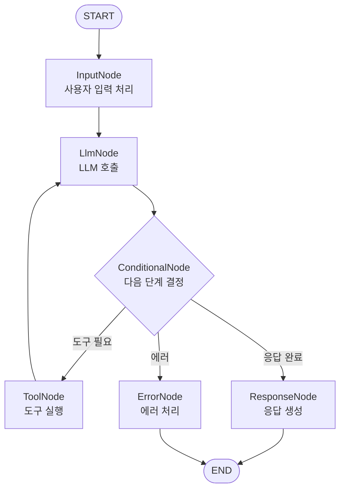

# Graph 설계 상세 문서

## 그래프 구조 다이어그램



## 노드 상세 명세

### 1. InputNode

**클래스명**: `InputNode`

**역할**: HTTP 요청에서 사용자 입력을 추출하여 AgentState에 저장

**입력**:
- HTTP Request (Controller에서 전달)
- AgentState (초기 상태)

**처리 로직**:
```java
public AgentState apply(AgentState state, HttpRequest request) {
    String userMessage = request.getBody().getMessage();
    UserMessage userMsg = new UserMessage(userMessage);
    
    state.setUserMessage(userMsg);
    state.getMessages().add(userMsg);
    state.setCurrentStep("input");
    
    return state;
}
```

**출력**: AgentState (userMessage 설정됨)

**에러 처리**: 입력이 비어있거나 null인 경우 에러 상태 설정

---

### 2. LlmNode

**클래스명**: `LlmNode`

**역할**: Spring AI ChatModel을 사용하여 LLM 호출 및 응답 생성

**입력**: AgentState (messages, toolExecutionResults)

**처리 로직**:
```java
public AgentState apply(AgentState state) {
    List<ChatMessage> messages = state.getMessages();
    
    // LLM 호출
    ChatResponse response = chatModel.call(messages);
    AiMessage aiMessage = response.getResult().getOutput();
    
    // 도구 실행 요청 추출
    List<ToolExecutionRequest> toolRequests = 
        extractToolRequests(aiMessage);
    
    state.setAiMessage(aiMessage);
    state.setToolExecutionRequests(toolRequests);
    state.getMessages().add(aiMessage);
    state.setCurrentStep("llm");
    state.incrementIterationCount();
    
    return state;
}
```

**출력**: AgentState (aiMessage, toolExecutionRequests 설정됨)

**조건부 분기**:
- 도구 실행 요청이 있으면 → ToolNode
- 응답 완료면 → ResponseNode
- 최대 반복 초과 → ErrorNode

---

### 3. ConditionalNode

**클래스명**: `ConditionalNode`

**역할**: 현재 상태를 기반으로 다음 노드를 결정

**입력**: AgentState

**처리 로직**:
```java
public String route(AgentState state) {
    // 도구 실행이 필요한 경우
    if (!state.getToolExecutionRequests().isEmpty()) {
        return "tool";
    }
    
    // 최대 반복 횟수 초과
    if (state.getIterationCount() > MAX_ITERATIONS) {
        return "error";
    }
    
    // 정상 응답 완료
    return "response";
}
```

**출력**: 다음 노드 이름 (String)

**가능한 반환값**:
- `"tool"`: ToolNode로 이동
- `"response"`: ResponseNode로 이동
- `"error"`: ErrorNode로 이동

---

### 4. ToolNode

**클래스명**: `ToolNode`

**역할**: 필요한 도구들을 실행하고 결과를 상태에 저장

**입력**: AgentState (toolExecutionRequests)

**처리 로직**:
```java
public AgentState apply(AgentState state) {
    List<ToolExecutionRequest> requests = state.getToolExecutionRequests();
    List<ToolExecutionResult> results = new ArrayList<>();
    
    for (ToolExecutionRequest request : requests) {
        try {
            // 도구 실행
            ToolExecutionResult result = executeTool(request);
            results.add(result);
        } catch (Exception e) {
            // 에러 처리
            ToolExecutionResult errorResult = 
                createErrorResult(request, e);
            results.add(errorResult);
        }
    }
    
    state.setToolExecutionResults(results);
    state.setCurrentStep("tool");
    
    return state;
}
```

**출력**: AgentState (toolExecutionResults 설정됨)

**도구 실행 예시**:
- CalculatorTool: 수식 계산
- SearchTool: 정보 검색
- 기타 등록된 도구들

---

### 5. ResponseNode

**클래스명**: `ResponseNode`

**역할**: 최종 응답을 포맷팅하여 반환

**입력**: AgentState (aiMessage)

**처리 로직**:
```java
public AgentResponse apply(AgentState state) {
    AiMessage aiMessage = state.getAiMessage();
    String responseText = aiMessage.text();
    
    AgentResponse response = AgentResponse.builder()
        .response(responseText)
        .sessionId(state.getSessionId())
        .toolsUsed(extractToolsUsed(state))
        .executionTime(calculateExecutionTime(state))
        .build();
    
    state.setCurrentStep("response");
    
    return response;
}
```

**출력**: AgentResponse (HTTP Response로 변환)

**응답 포맷**:
```json
{
  "response": "AI 응답 텍스트",
  "sessionId": "세션 ID",
  "toolsUsed": ["CalculatorTool"],
  "executionTime": 1.5
}
```

---

### 6. ErrorNode (선택사항)

**클래스명**: `ErrorNode`

**역할**: 에러 처리 및 사용자 친화적 에러 메시지 생성

**입력**: AgentState (error, exception)

**처리 로직**:
```java
public AgentResponse apply(AgentState state) {
    String errorMessage = state.getError();
    Exception exception = state.getException();
    
    // 사용자 친화적 에러 메시지 생성
    String userFriendlyMessage = 
        createUserFriendlyMessage(errorMessage, exception);
    
    AgentResponse response = AgentResponse.builder()
        .response(userFriendlyMessage)
        .error(true)
        .errorCode(getErrorCode(exception))
        .build();
    
    return response;
}
```

**출력**: AgentResponse (에러 정보 포함)

---

## Edge 정의

### 일반 Edge (Normal Edges)

1. **START → InputNode**
   - 그래프 시작점
   - 조건 없음

2. **InputNode → LlmNode**
   - 입력 처리 후 항상 LLM 호출
   - 조건 없음

3. **ToolNode → LlmNode**
   - 도구 실행 후 다시 LLM 호출하여 결과 처리
   - 조건 없음

### 조건부 Edge (Conditional Edges)

1. **LlmNode → ConditionalNode**
   - LLM 응답 후 다음 단계 결정
   - 조건 없음 (항상 실행)

2. **ConditionalNode → ToolNode**
   - 조건: `toolExecutionRequests`가 비어있지 않음
   - 조건: `iterationCount <= MAX_ITERATIONS`

3. **ConditionalNode → ResponseNode**
   - 조건: `toolExecutionRequests`가 비어있음
   - 조건: `iterationCount <= MAX_ITERATIONS`

4. **ConditionalNode → ErrorNode**
   - 조건: `iterationCount > MAX_ITERATIONS`
   - 조건: 에러 발생

---

## 상태 전이 다이어그램

```
초기 상태
  ↓
[input] → userMessage 설정
  ↓
[llm] → aiMessage 생성, toolExecutionRequests 생성
  ↓
[conditional] → 다음 단계 결정
  ↓
[tool] → toolExecutionResults 생성 (도구 필요 시)
  ↓
[llm] → toolExecutionResults를 기반으로 재응답 생성
  ↓
[conditional] → 다음 단계 결정
  ↓
[response] → 최종 응답 생성
  ↓
종료
```

---

## 반복 제어

### 최대 반복 횟수

- **기본값**: 5회
- **설정 가능**: application.properties에서 설정
- **목적**: 무한 루프 방지

### 반복 카운터 증가 시점

- LlmNode 실행 시마다 증가
- ConditionalNode에서 체크

### 반복 초과 시 동작

- ErrorNode로 이동
- 사용자에게 "요청이 너무 복잡합니다" 메시지 전달

---

## 에러 처리 전략

### 1. 입력 검증 실패
- **위치**: InputNode
- **처리**: ErrorNode로 이동, 에러 메시지 설정

### 2. LLM 호출 실패
- **위치**: LlmNode
- **처리**: 재시도 로직 (최대 3회), 실패 시 ErrorNode로

### 3. 도구 실행 실패
- **위치**: ToolNode
- **처리**: 에러 결과를 결과에 포함, LlmNode로 이동하여 에러 처리

### 4. 최대 반복 초과
- **위치**: ConditionalNode
- **처리**: ErrorNode로 이동

---

**작성일**: 2025-01-XX
**버전**: 1.0
